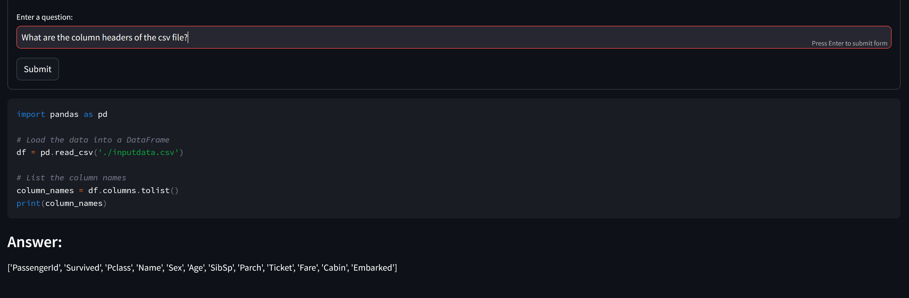

# LITHE1 - Lightweight Intelligent Tool for Handling Exports (Version 1)

LITHE1 is a versatile and lightweight intelligent tool designed to perform AI-driven insights on CSV files. Utilizing the power of the `ollama` module with the `phi4` model, LITHE1 provides an interactive experience for users to query and analyze their CSV data efficiently.

## Features

- **AI-Powered Analysis**: Leverages advanced AI models to understand and process user queries related to CSV data.
- **Interactive Querying**: Allows users to input questions and receive Python code that performs the requested analysis on the CSV file.
- **Automatic Code Generation and Execution**: Generates and executes Python scripts based on user queries to provide immediate answers.
- **Error Handling**: Includes mechanisms to handle connection issues with the LLM and CSV file reading errors.
- **Model Agnostic**: The default model used by LITHE1 is `phi4`, but can easily be changed to any model supported by [Ollama](https://www.ollama.com/library).
- **Offline Analysis**: The tool uses offline models provided by `Ollama` so your data doesn't get sent to a third party.

## Installation

[Install Ollama](https://ollama.com/) and download the necessary models.  The default model used by LITHE1 is [phi4](https://ollama.com/library/phi4).  This model can be downloaded from the command line:
```sh
ollama pull phi4
```

Ensure you have the following Python dependencies installed:

- `ollama`
- `pandas`
- `re`
- `subprocess`
- `streamlit`

Install the required Python packages:

```sh
pip install ollama pandas streamlit
```

## Usage

Place your CSV file in the same directory as `lithe1.py` and name it `inputdata.csv`.  Once you have done this you can run the tool:

```sh
streamlit run lithe1.py
```


Enter your questions about the CSV file when prompted. LITHE1 will generate and execute Python code to provide the answers. **Note: This tool is not intended for production use.  The project is running LLM generated code, which is highly dangerous.  We would advise running the tool in a docker container to prevent code execution.**


## Example

After starting the tool, you might enter a question like:

```
What are the column headers of the csv file?
```

LITHE1 will generate and execute the relevant Python code to answer your question.  The application will show you what code was generated and executed.



## Contributing

We welcome contributions to improve LITHE1. Feel free to submit issues or pull requests.


## License

This project is licensed under the MIT License.


## Acknowledgments

LITHE1 was developed by Josiah Bryan ([Halcy0nic](https://github.com/Halcy0nic)) at Skinny Research and Development to simplify the process of querying and analyzing CSV files using the latest AI technologies.
